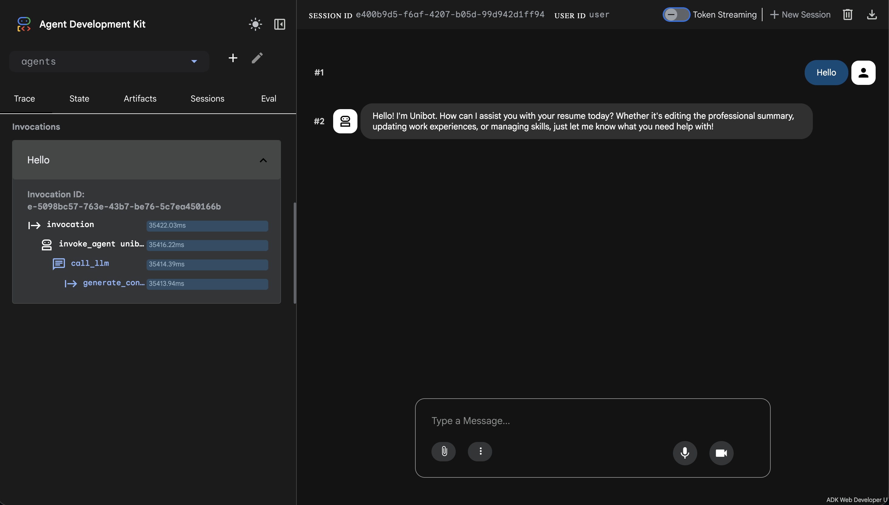
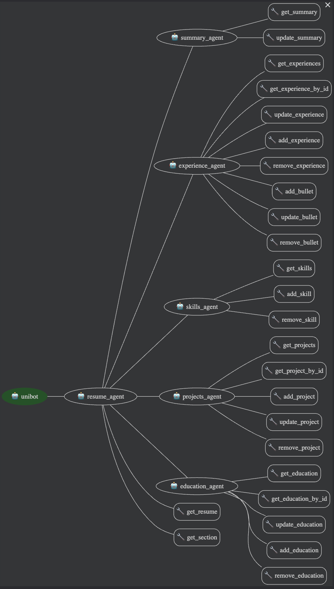
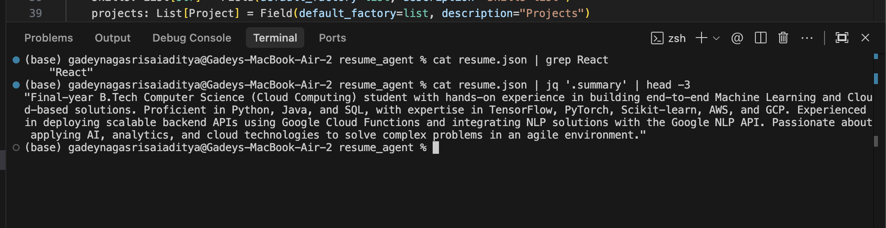

# ResumeForge - Multi-Agent Resume Editor

A production-grade multi-agent system built on Google's Agent Development Kit (ADK) that enables natural language-based resume editing through intelligent agent orchestration and tool-based operations. The system leverages local LLM inference via Ollama, eliminating API dependencies while maintaining enterprise-level functionality.




---

## Table of Contents

- [Overview](#overview)
- [Key Features](#key-features)
- [System Architecture](#system-architecture)
- [Technical Stack](#technical-stack)
- [Installation](#installation)
- [Configuration](#configuration)
- [Usage](#usage)
- [Agent Hierarchy](#agent-hierarchy)
- [Tool Reference](#tool-reference)
- [Data Schema](#data-schema)
- [Performance Metrics](#performance-metrics)
- [Troubleshooting](#troubleshooting)
- [Development](#development)

---

## Overview

ResumeForge implements a hierarchical multi-agent architecture where specialized agents handle domain-specific resume editing tasks. The system uses function calling and tool execution to perform precise, validated modifications to structured resume data stored in JSON format.

### What Makes This Unique

**1. Tool-Enforced Editing**
- Every modification goes through validated tool functions
- No direct JSON manipulation by LLM
- Pydantic schema validation on every write operation
- Atomic operations with rollback capability

**2. Hierarchical Agent Design**
- Three-tier agent hierarchy (Entry → Coordinator → Specialists)
- Clear separation of concerns and responsibilities
- Dynamic routing based on intent classification
- Sub-agent delegation with context preservation

**3. Local-First Architecture**
- Zero external API dependencies
- Complete data privacy and sovereignty
- Unlimited request capacity
- Offline operational capability

**4. Production-Ready Validation**
- Strict schema enforcement via Pydantic models
- Type safety across all data structures
- Referential integrity checks (e.g., experience IDs)
- Graceful error handling with user feedback

**5. Extensible Design**
- Modular agent architecture
- Plugin-style tool system
- Easy to add new resume sections
- Configurable LLM backend

---

## Key Features

### Natural Language Interface
Transform resume editing from manual JSON manipulation to conversational commands:
```
"Add Python to my skills"
"Make my summary more senior-focused"
"Add a bullet about leading a team of 5 engineers to my first job"
```

### Intelligent Agent Routing
The system automatically routes requests to appropriate specialist agents based on semantic understanding of the user's intent.

### Schema-Validated Operations
All modifications are validated against Pydantic models before persistence, ensuring data integrity and preventing corruption.

### Comprehensive Tool Library
30+ specialized tools covering all CRUD operations across resume sections with granular control (e.g., individual bullet point management).

### Local LLM Inference
Powered by Ollama with LiteLLM integration, supporting 100+ LLM providers while maintaining local-first operation.

---

## System Architecture

### Agent Hierarchy

```
┌─────────────────────────────────────────────────────┐
│                    Unibot                           │
│              (Root Entry Agent)                     │
│  - User greeting and request intake                 │
│  - High-level intent classification                 │
└──────────────────┬──────────────────────────────────┘
                   │
                   ▼
┌─────────────────────────────────────────────────────┐
│                ResumeAgent                          │
│            (Coordinator Agent)                      │
│  - Section identification                           │
│  - Sub-agent selection and delegation               │
│  - Tools: get_resume(), get_section()               │
└──────────────────┬──────────────────────────────────┘
                   │
       ┌───────────┴───────────┬───────────┬─────────┐
       ▼           ▼           ▼           ▼         ▼
┌──────────┐ ┌──────────┐ ┌──────────┐ ┌──────────┐ ┌──────────┐
│ Summary  │ │Experience│ │  Skills  │ │ Projects │ │Education │
│  Agent   │ │  Agent   │ │  Agent   │ │  Agent   │ │  Agent   │
└──────────┘ └──────────┘ └──────────┘ └──────────┘ └──────────┘
   2 tools      8 tools      3 tools      5 tools      5 tools
```

### Request Flow

```
User Input → Unibot → ResumeAgent → Specialist Agent → Tool Execution
                                                              ↓
                                                      Schema Validation
                                                              ↓
                                                      JSON Persistence
                                                              ↓
                                                      Success Response
```


### Data Flow Architecture

```
┌──────────────┐
│  User Input  │
└──────┬───────┘
       │
       ▼
┌──────────────────────┐
│  Intent Analysis     │
│  (LLM Processing)    │
└──────┬───────────────┘
       │
       ▼
┌──────────────────────┐
│  Tool Selection      │
│  (Function Calling)  │
└──────┬───────────────┘
       │
       ▼
┌──────────────────────┐
│  Tool Execution      │
│  (Python Functions)  │
└──────┬───────────────┘
       │
       ▼
┌──────────────────────┐
│  Schema Validation   │
│  (Pydantic Models)   │
└──────┬───────────────┘
       │
       ▼
┌──────────────────────┐
│  JSON Persistence    │
│  (resume.json)       │
└──────────────────────┘
```

---

## Technical Stack

### Core Framework
- **Google ADK (Agent Development Kit)**: Agent orchestration and lifecycle management
- **LiteLLM**: Universal LLM interface supporting 100+ providers
- **Pydantic v2**: Runtime type validation and data modeling

### LLM Infrastructure
- **Ollama**: Local LLM inference server
- **Qwen2.5-7B**: Primary model with function calling support
- **OpenAI-Compatible API**: Standard interface for model interaction

### Development Tools
- **Python 3.11+**: Core runtime
- **Virtual Environment**: Dependency isolation
- **JSON**: Structured data storage


## High-Level Diagram

Here is a diagram showing how the different parts of the system work together



---

## Installation

### Prerequisites

Ensure the following are installed on your system:

```bash
# Python 3.11 or higher
python3 --version

# Ollama (for local LLM inference)
# Download from: https://ollama.ai
# Or install via Homebrew:
brew install ollama
```

### Step 1: Environment Setup

```bash
# Navigate to project directory
cd /path/to/ResumeForge/resume_agent

# Create isolated Python environment
python3 -m venv .venv

# Activate virtual environment
# macOS/Linux:
source .venv/bin/activate
# Windows:
.venv\Scripts\activate
```

### Step 2: Dependency Installation

```bash
# Install core dependencies
pip install google-adk>=1.0.0 pydantic>=2.0.0

# Install extensions for Ollama support
pip install 'google-adk[extensions]'

# Verify installation
python3 -c "import google.adk; import litellm; print('Dependencies installed successfully')"
```

### Step 3: Model Acquisition

```bash
# Pull Qwen2.5 model (supports function calling)
ollama pull qwen2.5:7b

# Verify model availability
ollama list

# Expected output:
# NAME              ID              SIZE      MODIFIED
# qwen2.5:7b        2bada8a74506    4.7 GB    X minutes ago
```

### Step 4: Configuration

Create or verify `.env` file in project root:

```bash
# .env
OPENAI_API_KEY=ollama
OPENAI_BASE_URL=http://localhost:11434/v1
```

### Step 5: Verification

```bash
# Test agent initialization
python3 -c "from agents.unibot import unibot; print('Agent system initialized:', unibot.name)"

# Expected output:
# Agent system initialized: unibot
```

---

## Configuration

### Environment Variables

The system uses environment variables for LLM backend configuration:

```bash
# .env file structure
OPENAI_API_KEY=ollama          # Dummy key for Ollama
OPENAI_BASE_URL=http://localhost:11434/v1  # Ollama API endpoint
```

### Model Configuration

Each agent is configured with model specifications in their respective files:

```python
# Example: agents/summary_agent.py
summary_agent = Agent(
    name="summary_agent",
    model="openai/qwen2.5:7b",  # Model identifier
    description="Specialist agent for editing the professional summary section of the resume.",
    instruction=SUMMARY_AGENT_PROMPT,
    tools=[get_summary, update_summary],
)
```

### Supported Models

Models must support **function calling** (tool use). Recommended options:

| Model | Parameters | Size | Function Calling | Performance |
|-------|-----------|------|------------------|-------------|
| `qwen2.5:7b` | 7B | 4.7 GB | Yes | Excellent |
| `llama3.1:8b` | 8B | 4.7 GB | Yes | Very Good |
| `gemma2:9b` | 9B | 5.5 GB | Yes | Very Good |
| `mistral:7b` | 7B | 4.1 GB | Yes | Good |

**Note**: Models without function calling support (e.g., `deepseek-r1`) will fail with tool-related errors.

### Switching Models

To change the LLM model:

1. Pull the new model: `ollama pull <model-name>`
2. Update all agent files in `agents/` directory
3. Clear Python cache: `find . -type d -name "__pycache__" -exec rm -rf {} +`
4. Restart the server: `adk web`

---

## Usage

### Starting the System

```bash
# Terminal 1: Start Ollama server
ollama serve

# Terminal 2: Start ResumeForge
cd /path/to/ResumeForge/resume_agent
source .venv/bin/activate
adk web

# Access the web interface
# Navigate to: http://localhost:8000
```


### Example Interactions

#### Adding Skills

```
User: Add Python to my skills
System: [Routes to SkillsAgent]
        [Executes: add_skill("Python")]
        [Validates schema]
        [Saves to resume.json]
Response: Successfully added "Python" to skills section
```

#### Updating Professional Summary

```
User: Make my summary more senior-focused, emphasizing leadership and architecture
System: [Routes to SummaryAgent]
        [Executes: update_summary(new_text)]
        [Validates schema]
Response: Professional summary updated successfully
```

#### Managing Experience Bullets

```
User: Add a bullet to my first job about leading a team of 5 engineers on a microservices migration
System: [Routes to ExperienceAgent]
        [Executes: add_bullet("exp_1", "Led team of 5 engineers...")]
        [Validates schema]
Response: Added bullet point to OSFIN.AI experience
```

#### Editing Projects

```
User: Update my Cloud Resume Parser project to mention AWS Lambda deployment
System: [Routes to ProjectsAgent]
        [Executes: update_project("proj_1", description="...")]
        [Validates schema]
Response: Updated Cloud-Based Resume Parser project
```




---

## Agent Hierarchy

### Unibot (Root Agent)

**Responsibility**: Entry point and high-level request routing

**Capabilities**:
- User greeting and engagement
- Intent classification
- Delegation to ResumeAgent for resume-related requests

**Sub-agents**: `[resume_agent]`

**Tools**: None (pure routing)

---

### ResumeAgent (Coordinator)

**Responsibility**: Section identification and specialist delegation

**Capabilities**:
- Analyze user request to identify target resume section
- Select appropriate specialist agent
- Provide context to sub-agents

**Sub-agents**: `[summary_agent, experience_agent, skills_agent, projects_agent, education_agent]`

**Tools**:
- `get_resume()`: Retrieve complete resume data
- `get_section(section_name)`: Retrieve specific section

---

### SummaryAgent (Specialist)

**Responsibility**: Professional summary editing

**Tools**:
- `get_summary()`: Read current summary text
- `update_summary(new_text)`: Replace summary with new content

**Validation**: Ensures summary is non-empty string

---

### ExperienceAgent (Specialist)

**Responsibility**: Work experience management

**Tools**:
- `get_experiences()`: List all experience entries
- `get_experience_by_id(id)`: Retrieve specific entry
- `update_experience(id, company, role, dates)`: Modify entry metadata
- `add_experience(company, role, dates, bullets)`: Create new entry
- `remove_experience(id)`: Delete entry
- `add_bullet(exp_id, text)`: Append bullet point
- `update_bullet(exp_id, index, text)`: Modify existing bullet
- `remove_bullet(exp_id, index)`: Delete bullet point

**Validation**: Experience model with ID, company, role, dates, and bullets list

---

### SkillsAgent (Specialist)

**Responsibility**: Skills list management

**Tools**:
- `get_skills()`: Retrieve all skills
- `add_skill(skill)`: Add new skill (prevents duplicates)
- `remove_skill(skill)`: Remove existing skill

**Validation**: Skills must be unique strings

---

### ProjectsAgent (Specialist)

**Responsibility**: Project portfolio management

**Tools**:
- `get_projects()`: List all projects
- `get_project_by_id(id)`: Retrieve specific project
- `add_project(name, description, technologies)`: Create new project
- `update_project(id, name, description, technologies)`: Modify project
- `remove_project(id)`: Delete project

**Validation**: Project model with ID, name, description, and technologies list

---

### EducationAgent (Specialist)

**Responsibility**: Education history management

**Tools**:
- `get_education()`: List all education entries
- `get_education_by_id(id)`: Retrieve specific entry
- `add_education(institution, degree, dates, details)`: Create new entry
- `update_education(id, institution, degree, dates, details)`: Modify entry
- `remove_education(id)`: Delete entry

**Validation**: Education model with ID, institution, degree, dates, and optional details

---

## Tool Reference

### Tool Design Principles

1. **Single Responsibility**: Each tool performs one atomic operation
2. **Idempotency**: Safe to retry without side effects
3. **Validation**: Schema validation before persistence
4. **Error Handling**: Graceful failures with descriptive messages

### Tool Implementation Pattern

```python
def tool_function(param: str) -> str:
    """Tool description for LLM understanding."""
    # 1. Load current data
    data = _load_resume()
    
    # 2. Perform operation
    data['section'].append(param)
    
    # 3. Validate with Pydantic
    Resume(**data)
    
    # 4. Persist changes
    return _save_resume(data)
```

### Complete Tool Catalog

#### Summary Tools (2)
- `get_summary() -> str`
- `update_summary(new_text: str) -> str`

#### Skills Tools (3)
- `get_skills() -> List[str]`
- `add_skill(skill: str) -> str`
- `remove_skill(skill: str) -> str`

#### Experience Tools (8)
- `get_experiences() -> List[Experience]`
- `get_experience_by_id(id: str) -> Experience`
- `update_experience(id: str, company: str, role: str, dates: str) -> str`
- `add_experience(company: str, role: str, dates: str, bullets: List[str]) -> str`
- `remove_experience(id: str) -> str`
- `add_bullet(exp_id: str, text: str) -> str`
- `update_bullet(exp_id: str, index: int, text: str) -> str`
- `remove_bullet(exp_id: str, index: int) -> str`

#### Projects Tools (5)
- `get_projects() -> List[Project]`
- `get_project_by_id(id: str) -> Project`
- `add_project(name: str, description: str, technologies: List[str]) -> str`
- `update_project(id: str, name: str, description: str, technologies: List[str]) -> str`
- `remove_project(id: str) -> str`

#### Education Tools (5)
- `get_education() -> List[Education]`
- `get_education_by_id(id: str) -> Education`
- `add_education(institution: str, degree: str, dates: str, details: str) -> str`
- `update_education(id: str, institution: str, degree: str, dates: str, details: str) -> str`
- `remove_education(id: str) -> str`

---

## Data Schema

### Pydantic Models

```python
class Experience(BaseModel):
    id: str = Field(..., description="Unique identifier (e.g., exp_1)")
    company: str = Field(..., description="Company name")
    role: str = Field(..., description="Job title/role")
    dates: str = Field(..., description="Employment period")
    bullets: List[str] = Field(default_factory=list, description="Achievement bullets")

class Project(BaseModel):
    id: str = Field(..., description="Unique identifier (e.g., proj_1)")
    name: str = Field(..., description="Project name")
    description: str = Field(..., description="Project description")
    technologies: List[str] = Field(default_factory=list, description="Technologies used")

class Education(BaseModel):
    id: str = Field(..., description="Unique identifier (e.g., edu_1)")
    institution: str = Field(..., description="Institution name")
    degree: str = Field(..., description="Degree/qualification")
    dates: str = Field(..., description="Study period")
    details: str = Field(default="", description="Additional details")

class Resume(BaseModel):
    summary: str = Field(..., description="Professional summary")
    experiences: List[Experience] = Field(default_factory=list)
    skills: List[str] = Field(default_factory=list)
    projects: List[Project] = Field(default_factory=list)
    education: List[Education] = Field(default_factory=list)
```

### JSON Structure

```json
{
  "summary": "Professional summary paragraph...",
  "experiences": [
    {
      "id": "exp_1",
      "company": "Company Name",
      "role": "Senior Software Engineer",
      "dates": "Jan 2024 - Present",
      "bullets": [
        "Led development of microservices architecture",
        "Reduced latency by 40% through optimization"
      ]
    }
  ],
  "skills": ["Python", "JavaScript", "AWS", "Docker"],
  "projects": [
    {
      "id": "proj_1",
      "name": "Cloud Resume Parser",
      "description": "Serverless resume parsing system",
      "technologies": ["AWS Lambda", "Python", "DynamoDB"]
    }
  ],
  "education": [
    {
      "id": "edu_1",
      "institution": "University Name",
      "degree": "B.Tech Computer Science",
      "dates": "2020 - 2024",
      "details": "GPA: 3.8/4.0"
    }
  ]
}
```


### Adding New Agents

1. Create agent file in `agents/` directory
2. Define agent with appropriate tools
3. Register as sub-agent in coordinator
4. Add tool functions in `tools.py`
5. Update schema in `schema.py` if needed

### Extending Tool Library

```python
# In tools.py
def new_tool_function(param: str) -> str:
    """
    Tool description for LLM.
    
    Args:
        param: Parameter description
        
    Returns:
        Success message
    """
    data = _load_resume()
    # Implement logic
    return _save_resume(data)

# In agent file
agent = Agent(
    name="agent_name",
    tools=[existing_tools, new_tool_function],
    # ... other config
)
```

### Testing

```bash
# Test agent initialization
python3 -c "from agents.unibot import unibot; print(unibot)"

# Test tool execution
python3 -c "from tools import get_skills; print(get_skills())"

# Validate schema
python3 -c "from schema import Resume; import json; Resume(**json.load(open('resume.json')))"
```

---

## Development

### Project Structure

```
resume_agent/
├── agents/                    # Agent implementations
│   ├── __init__.py
│   ├── unibot.py             # Root agent
│   ├── resume_agent.py       # Coordinator
│   ├── summary_agent.py      # Summary specialist
│   ├── experience_agent.py   # Experience specialist
│   ├── skills_agent.py       # Skills specialist
│   ├── projects_agent.py     # Projects specialist
│   └── education_agent.py    # Education specialist
├── tools.py                   # Tool function implementations
├── schema.py                  # Pydantic data models
├── resume.json                # Resume data storage
├── .env                       # Environment configuration
├── requirements.txt           # Python dependencies
├── README.md                  # This file
└── TestingPICS/              # Screenshot assets
    ├── Screenshot 2026-02-08 at 3.07.32 AM.png
    ├── Screenshot 2026-02-08 at 3.07.58 AM.png
    └── Screenshot 2026-02-08 at 3.12.45 AM.png
```

### Adding New Agents

1. Create agent file in `agents/` directory
2. Define agent with appropriate tools
3. Register as sub-agent in coordinator
4. Add tool functions in `tools.py`
5. Update schema in `schema.py` if needed

### Extending Tool Library

```python
# In tools.py
def new_tool_function(param: str) -> str:
    """
    Tool description for LLM.
    
    Args:
        param: Parameter description
        
    Returns:
        Success message
    """
    data = _load_resume()
    # Implement logic
    return _save_resume(data)

# In agent file
agent = Agent(
    name="agent_name",
    tools=[existing_tools, new_tool_function],
    # ... other config
)
```

### Testing

```bash
# Test agent initialization
python3 -c "from agents.unibot import unibot; print(unibot)"

# Test tool execution
python3 -c "from tools import get_skills; print(get_skills())"

# Validate schema
python3 -c "from schema import Resume; import json; Resume(**json.load(open('resume.json')))"
```

---

## Design Principles

### 1. Tool Enforcement
All resume modifications must go through validated tool functions. Direct JSON manipulation is prohibited to ensure data integrity.

### 2. Minimal Changes
Tools modify only the specific data requested, preserving all other resume content unchanged.

### 3. Schema Safety
Pydantic validation occurs before every write operation, preventing data corruption and ensuring type safety.

### 4. Clear Boundaries
Each agent has exclusive responsibility for its domain, preventing conflicts and ensuring predictable behavior.

### 5. Clarification Over Assumption
Agents request clarification when user intent is ambiguous rather than making potentially incorrect assumptions.

---

## License

MIT License - Open source and free to use, modify, and distribute.

---

## Acknowledgments

**Built With**:
- [Google Agent Development Kit (ADK)](https://github.com/google/adk) - Agent orchestration framework
- [Ollama](https://ollama.ai) - Local LLM inference server
- [LiteLLM](https://github.com/BerriAI/litellm) - Universal LLM interface
- [Qwen2.5](https://huggingface.co/Qwen) - Function-calling capable language model
- [Pydantic](https://docs.pydantic.dev/) - Data validation framework

---

## References

- [Google ADK Documentation](https://google.github.io/adk-docs/)
- [Ollama Documentation](https://github.com/ollama/ollama)
- [LiteLLM Provider Documentation](https://docs.litellm.ai/docs/providers)
- [Pydantic Documentation](https://docs.pydantic.dev/latest/)

---

**ResumeForge** - Professional resume editing through intelligent agent orchestration

---

Done By : Adityagnss@2026
