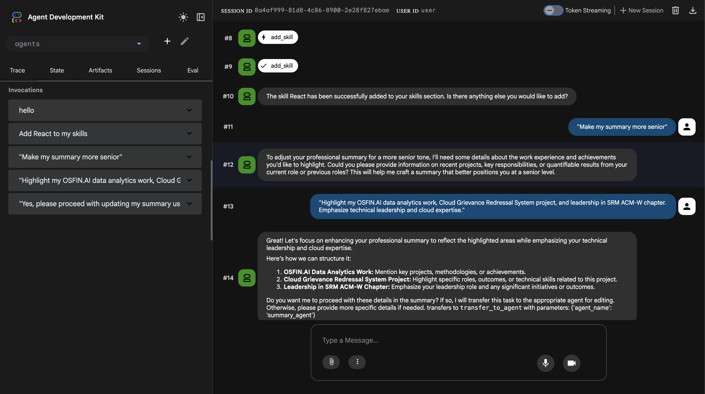
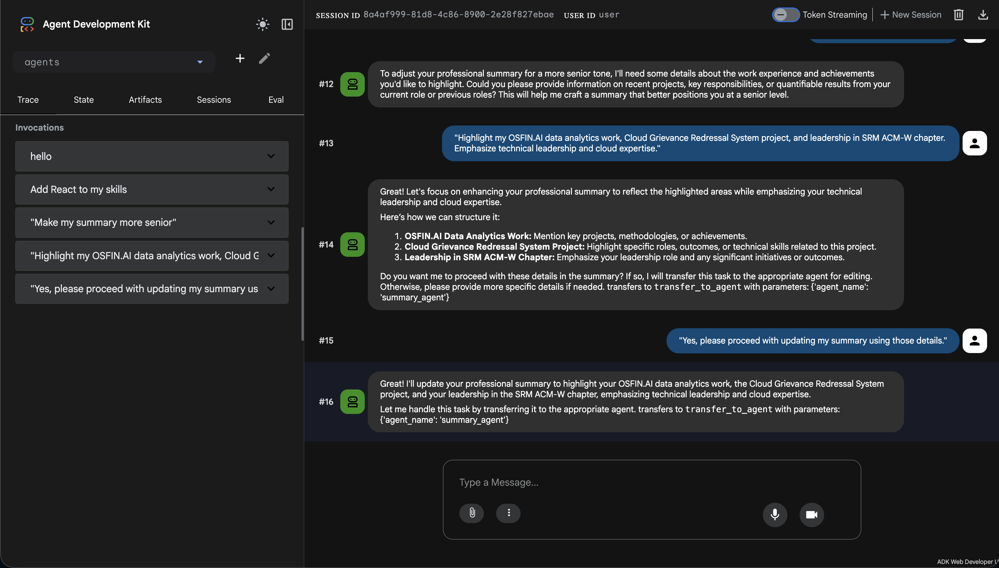
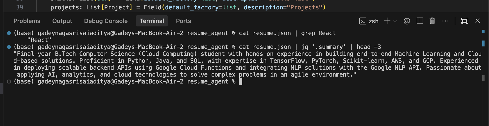

# ResumeForge

A multi-agent AI system that lets you edit your resume using plain English. Just type what you want changed, and the agents handle the rest.

> Built with [Google ADK](https://google.github.io/adk-docs/) and powered by **Gemini 2.0 Flash**.



---

## What It Does

Instead of manually editing your resume file, you just talk to ResumeForge:

- *"Add Python to my skills"*
- *"Make my summary sound more senior"*
- *"Add a bullet point about team leadership to my first job"*
- *"Add a new project called X with description Y"*

The system figures out which part of the resume you mean and updates it for you.

---

## How It Works

ResumeForge has a team of AI agents, each responsible for one section of the resume:

```
You
 └── Unibot (Entry point — understands your request)
      └── ResumeAgent (Coordinator — routes to the right specialist)
           ├── SummaryAgent   → edits your professional summary
           ├── ExperienceAgent → edits jobs, roles, bullet points
           ├── SkillsAgent    → adds/removes skills
           ├── ProjectsAgent  → manages project entries
           └── EducationAgent → manages education entries
```

Your resume is stored as a `resume.json` file. The agents read and write to it using tools — they never guess or hallucinate your data.

---

## Quick Start

### 1. Prerequisites

- Python 3.11+
- A free [Google Gemini API key](https://aistudio.google.com/app/apikey)

### 2. Clone & Install

```bash
git clone https://github.com/Adityagnss/ResumeForge.git
cd ResumeForge/resume_agent

python3 -m venv .venv
source .venv/bin/activate

pip install -r requirements.txt
```

### 3. Set Up Your API Key

```bash
cp .env.example .env
```

Open `.env` and add your Gemini API key:

```
GOOGLE_API_KEY=your_key_here
GOOGLE_GENAI_USE_VERTEXAI=FALSE
```

### 4. Run

```bash
adk web
```

Then open [http://localhost:8000](http://localhost:8000) in your browser.



---

## Example Interactions

```
You: Hello
Unibot: Hi! I'm ResumeForge. I can help you edit your resume — just tell me what you'd like to change.

You: Add Docker to my skills
→ SkillsAgent adds "Docker" to your skills list ✓

You: Make my summary more concise
→ SummaryAgent reads your current summary and rewrites it ✓

You: Add a bullet point about improving API response time by 40% to my first job
→ ExperienceAgent adds the bullet to exp_1 ✓
```



---

## Project Structure

```
resume_agent/
├── agents/
│   ├── unibot.py           # Entry point agent
│   ├── resume_agent.py     # Coordinator agent
│   ├── summary_agent.py    # Professional summary specialist
│   ├── experience_agent.py # Work experience specialist
│   ├── skills_agent.py     # Skills specialist
│   ├── projects_agent.py   # Projects specialist
│   └── education_agent.py  # Education specialist
├── tools.py                # All read/write tools for resume.json
├── schema.py               # Pydantic schema for resume structure
├── resume.json             # Your resume data (edit this to personalize)
├── requirements.txt
└── .env                    # Your API key goes here
```

---

## Customizing Your Resume

Edit `resume.json` to put in your own information before running. The file follows this structure:

```json
{
  "name": "Your Name",
  "summary": "Your professional summary...",
  "skills": ["Python", "Docker"],
  "experiences": [...],
  "projects": [...],
  "education": [...]
}
```

---

## Tech Stack

| Component | Technology |
|-----------|-----------|
| Agent Framework | Google ADK |
| LLM | Gemini 2.0 Flash |
| Data Schema | Pydantic v2 |
| Data Storage | JSON |
| UI | ADK Web Interface |

---

## Troubleshooting

**`GOOGLE_API_KEY` not found**
→ Make sure you copied `.env.example` to `.env` and filled in your key.

**`ModuleNotFoundError`**
→ Make sure your virtual environment is active: `source .venv/bin/activate`

**Agent not responding / errors**
→ Check that your API key is valid at [aistudio.google.com](https://aistudio.google.com)

---

**ResumeForge** — Professional resume editing through intelligent agent orchestration
